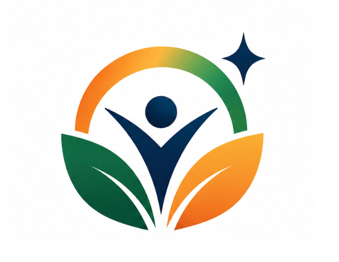

# SchemeMatch

<div align="center">
  
  <h3>AI-Driven Scheme Intelligence & Bank-Ready DPR Platform</h3>
  <p>Empowering marginalized entrepreneurs (SC, ST, OBC, Women, Rural Artisans, Safai Karamcharis) across India to discover, evaluate, and secure government capital subsidies and concessional credit.</p>

  [](https://react.dev/)
  [](https://www.typescriptlang.org/)
  [](https://vitejs.dev/)
  [](https://nodejs.org/)
  [](https://expressjs.com/)
  [](LICENSE)
</div>

---

## 🌟 Overview

**SchemeMatch** transforms complex, fragmented government schemes into a living, intelligent workspace. By combining multi-factor demographic matching, automated financial engineering for bank-ready Detailed Project Reports (DPR), and document readiness verification, SchemeMatch closes the critical last-mile gap between marginalized entrepreneurs and government funding.

---

## ✨ Key Platform Features

### 1. 🎯 Explainable Multi-Factor Scheme Matcher
- **Target Groups**: Scheduled Castes (SC), Scheduled Tribes (ST), Other Backward Classes (OBC), Safai Karamcharis, Women-Led Enterprises, Rural Artisans, and Street Vendors.
- **Affirmative Rules Engine**: Evaluates rural/urban location tiers, income thresholds (<₹3 Lakh), promoter margin contribution (capped at 5%), and capital subsidy rates (up to 35%).
- **Explainable Scores**: Every match is accompanied by high-confidence eligibility checklists and potential grant calculations.

### 2. 📊 Bank-Ready DPR (Detailed Project Report) Generator
- **Bank-Compliant Modeling**: Formatted to SIDBI and PMEGP appraisal standards.
- **Automated Projections**: 3-year sales, net profit, Debt Service Coverage Ratio (DSCR > 1.50 "Highly Bankable"), and break-even points.
- **Capital Outlay Breakdown**: Automates promoter contribution (5%), bank term loan (60%), and non-refundable government capital subsidy (35%).

### 3. 📁 Document Readiness Scanner & Vault
- **Pre-Submission Verification**: Checks Aadhaar, PAN, Caste Certificate, Udyam Registration, Land/Workshop Lease NOC, and Bank Statements.
- **Readiness Scoring**: Instant diagnostic score (e.g. 75% Bank Ready) with clear remedies for missing credentials.

### 4. ⚖️ Multi-Scheme Comparison Matrix
- **Side-by-Side Analysis**: Compare 2 to 3 schemes across loan ceilings, interest subventions (as low as 4% via NSFDC), repayment tenures, and CGTMSE guarantee cover (up to 85% collateral-free).

### 5. 🗺️ Application Navigator & Nodal Partner Directory
- **6-Stage Milestone Roadmap**: Tracks application from Registration → DIC Task Force Scrutiny → Bank Underwriting → Sanction → DBT Capital Grant Disbursal.
- **Channel Partner Locator**: Connects entrepreneurs with nearby State Bank of India, Regional Rural Banks, and State Channelizing Agencies (SCAs).

### 6. 🗣️ Multilingual Voice Copilot ("Saathi AI")
- **Vernacular Accessibility**: Full interface and voice copilot support for **English**, **हिन्दी (Hindi)**, **தமிழ் (Tamil)**, **मराठी (Marathi)**, and **বাংলা (Bengali)**.
- **Speech Synthesis**: Audio briefings of eligibility summaries and financial viability metrics.

---

## 🏗️ Architecture

```
SchemeMatch/
├── client/                     # Frontend Application (React 19 + TypeScript + Vite)
│   ├── public/                 # Static assets & 4K brand visuals
│   │   ├── logo.png
│   │   ├── hero-showcase.png   # 4K Scroll Window 1 Visual
│   │   ├── superpowered-showcase.png # 4K Scroll Window 2 Visual
│   │   └── bento-showcase.png  # 4K Scroll Window 3 Visual
│   └── src/
│       ├── components/         # Modular UI & Landing Page Scroll Windows
│       │   ├── Header.tsx
│       │   ├── HeroScrollWindow.tsx
│       │   ├── SuperpoweredCardsSection.tsx
│       │   ├── BentoShowcase.tsx
│       │   ├── ConnectedFeatures.tsx
│       │   ├── FullDashboardShowcase.tsx
│       │   ├── BottomCTA.tsx
│       │   ├── EligibilityWizard.tsx
│       │   ├── DprGeneratorView.tsx
│       │   ├── DocumentReadiness.tsx
│       │   ├── SchemeComparison.tsx
│       │   ├── ApplicationNavigator.tsx
│       │   └── SaathiAICopilot.tsx
│       ├── context/            # React Context (Profile, Language)
│       ├── data/               # Local fallbacks & verified schemas
│       ├── utils/              # Translations & calculations
│       └── index.css           # Global Design System (Vanilla CSS tokens)
├── server/                     # Backend API (Node.js + Express + TypeScript)
│   ├── src/
│   │   ├── data/               # Central Scheme Database (23+ verified schemes)
│   │   │   └── schemes.json
│   │   └── index.ts            # REST API endpoints & matching algorithms
│   ├── package.json
│   └── tsconfig.json
├── package.json                # Root orchestration package
└── README.md
```

---

## 🚀 Quick Start

### Prerequisites
- [Node.js](https://nodejs.org/) (version 18.0 or higher)
- [npm](https://www.npmjs.com/) (version 9.0 or higher)

### 1. Clone the Repository
```bash
git clone https://github.com/your-username/schemematch.git
cd schemematch
```

### 2. Install All Dependencies
Install dependencies across root, server, and client with a single command:
```bash
npm run install:all
```

Alternatively, install individually:
```bash
# Install root
npm install

# Install server
cd server && npm install

# Install client
cd ../client && npm install
cd ..
```

### 3. Run Development Servers
Start both the backend API (`port 5000`) and the client dev server (`port 3000`) concurrently:
```bash
npm run dev
```

The application will be accessible at:
- **Client Frontend**: [http://127.0.0.1:3000](http://127.0.0.1:3000)
- **Backend API**: [http://localhost:5000/api/health](http://localhost:5000/api/health)

---

## 📡 API Endpoints

| Method | Endpoint | Description |
|---|---|---|
| `GET` | `/api/health` | Service health status and scheme count |
| `POST` | `/api/match` | Evaluates user profile against 23+ schemes with explainable factors |
| `POST` | `/api/dpr/generate` | Generates 3-year bank-ready cash flows, DSCR, and capital subsidies |
| `POST` | `/api/documents/scan` | Analyzes document checklist readiness and missing item remedies |
| `POST` | `/api/chat` | AI Copilot conversational assistance with multi-turn context |

---

## 🏛️ Supported Schemes & Apex Corporations

SchemeMatch features verified database models for national government programs:
- **MoSJE Apex Corporations**:
  - NSFDC (National Scheduled Castes Finance and Development Corporation)
  - NSTFDC (National Scheduled Tribes Finance and Development Corporation)
  - NBCFDC (National Backward Classes Finance and Development Corporation)
  - NSKFDC (National Safai Karamcharis Finance and Development Corporation)
  - NDFDC (National Divyangjan Finance and Development Corporation)
- **Ministry of MSME & Financial Services**:
  - **PMEGP** (Prime Minister’s Employment Generation Programme - 35% Rural Subsidy)
  - **Stand-Up India Scheme** (₹10 Lakh to ₹1 Crore for SC/ST & Women)
  - **PM Vishwakarma** (Concessional 5% credit & toolkit support for traditional artisans)
  - **PM SVANidhi** (Micro-credit working capital for urban street vendors)
  - **Pradhan Mantri Mudra Yojana** (Shishu, Kishore, Tarun)

---

## 📄 License

This project is licensed under the MIT License - see the [LICENSE](LICENSE) file for details.
